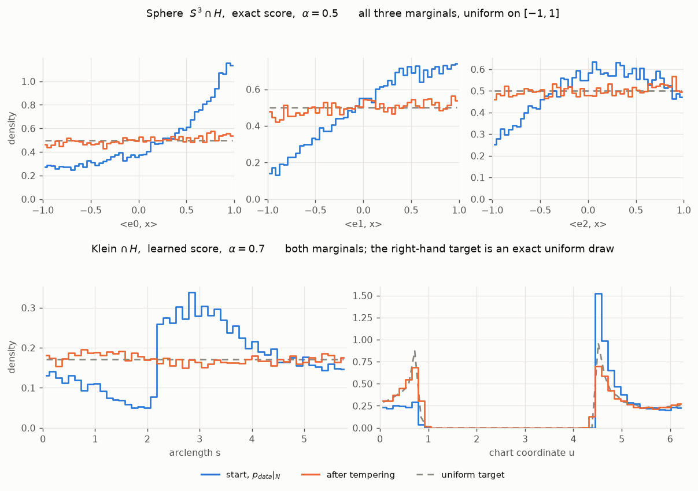
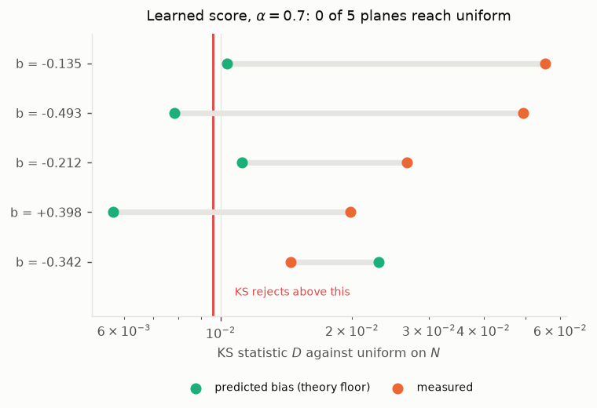
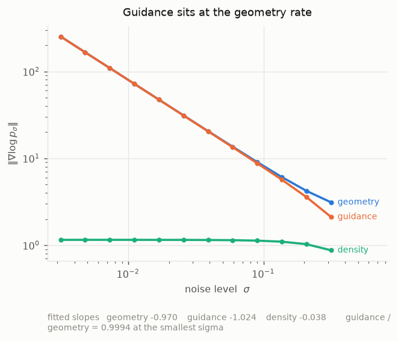
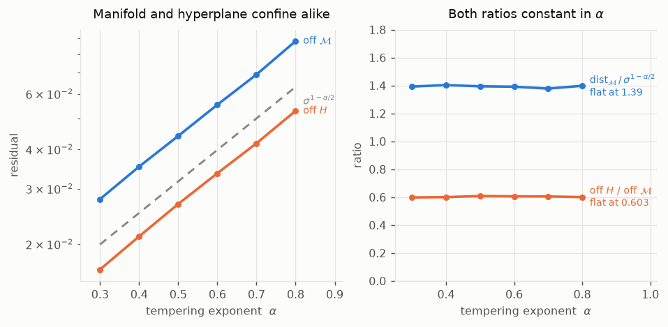
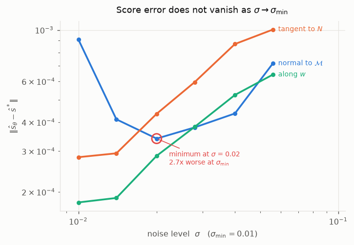

# dgeom

Sample uniformly from a curved surface, and from a slice through it.
Builds on [*When Scores Learn Geometry*](https://arxiv.org/abs/2509.24912)
(Li, Shen, Hsieh & He).

## The problem

A diffusion model learns a data distribution on a curved surface
$`\mathcal{M}\subset\mathbb{R}^d`$. Sampling gives common things often and rare
things rarely. Sometimes you want every part of the surface equally often: the
uniform distribution. The paper above shows how to get it.

We ask the same question for a **slice**. Cut with a hyperplane
$`H=\{x:\langle w,x\rangle=b\}`$ and keep $`N=\mathcal{M}\cap H`$, one dimension
smaller. Can we sample uniformly from $`N`$, using a frozen model that never saw
$`N`$ or $`w`$?

## Notation

**Shapes and points**

| symbol | meaning |
| --- | --- |
| $`\mathcal{M}`$, $`n`$ | the surface (manifold) and its dimension; $`d=4`$ throughout |
| $`d-n`$ | codimension: directions pointing off the surface |
| $`w`$, $`b`$, $`H`$ | unit normal, offset, and the cut $`\{x:\langle w,x\rangle=b\}`$ |
| $`N`$ | the slice $`\mathcal{M}\cap H`$, dimension $`n-1`$ (the section) |
| $`L`$ | length of a slice, when it is a curve |
| $`\mathbb{R}^d`$, $`\mathbb{E}`$ | the ambient space; expectation |
| $`x_0`$, $`x`$, $`X`$ | a clean point on $`\mathcal{M}`$; a noisy point off it; the sampler's state |
| $`\sigma`$, $`\sigma_{\min}`$ | noise size; smallest $`\sigma`$ the model was trained on |
| $`\rho`$ | distance from $`\mathcal{M}`$, in units of $`\sigma`$ |
| $`T_x\mathcal{M}`$, $`P_{\mathcal{M}}`$ | tangent space at $`x`$; nearest point on $`\mathcal{M}`$ |
| $`\kappa`$ | $`\lVert P_{T_x\mathcal{M}}w\rVert`$: how much of $`w`$ lies along the surface |
| $`d_{\mathcal{M}}(x)`$ | $`\tfrac12\,\mathrm{dist}^2(x,\mathcal{M})`$; likewise $`d_H`$, $`d_N`$ |
| $`\Phi`$, $`g(u)`$ | chart from flat coordinates $`u`$; metric, $`\sqrt{\det g}`$ is the area element |

**Distributions and scores**

| symbol | meaning |
| --- | --- |
| $`p_{\mathrm{data}}`$, $`p_\sigma`$ | data distribution; the same after adding noise $`\sigma`$ |
| $`p_{\mathrm{data}}\vert_N`$ | data distribution restricted to the slice |
| $`p^N_\sigma`$, $`p^{\mathrm{vMF}}_\sigma`$ | uniform on the slice, and the real data, after noising |
| $`\mathrm{Unif}(N)`$ | the target |
| $`s=\nabla\log p_\sigma`$ | the **score**; $`s^\ast`$ is the exact one |
| $`\hat{s}=\sigma^2 s`$ | the **hat score**, rescaled to stay around 1; $`\hat{s}_\theta`$ is the network's |
| $`C(x)`$ | curvature term in the expansion, independent of $`\sigma`$ |
| $`\tilde\pi_\sigma`$ | the distribution the sampler settles at |

**Sampler and measurement**

| symbol | meaning |
| --- | --- |
| $`\alpha`$ | **tempering exponent**: the score is multiplied by $`\sigma^\alpha`$ |
| $`\eta`$, $`T`$, $`\xi`$ | step size, step count, a draw from $`\mathcal{N}(0,I)`$ |
| $`m(x)`$, $`v_c`$ | expected $`\langle w,x_0\rangle`$ given the noisy point, minus $`b`$; its variance |
| $`\hat{g}`$, $`\gamma`$ | **guidance**, and its weight (1 everywhere here) |
| $`\beta`$ | how fast the score error shrinks: error $`=o(\sigma^\beta)`$ |
| $`e`$, $`K`$ | error vector $`\hat{s}_\theta-\hat{s}^\ast`$; the region it is measured over |
| $`D`$ | KS statistic: largest gap between two distributions |
| $`P`$, $`Q`$ | fitted in $`\log\lVert e\rVert = c + P\log\sigma + Q\log\rho`$ |
| $`\Theta(f)`$, $`o(f)`$, $`\ll`$ | same rate as $`f`$; strictly slower than $`f`$; much smaller than |

The paper writes the curvature term as $`H(x)`$; we use $`C(x)`$, since $`H`$ is
the cut. $`d`$ is a dimension, $`d_{\mathcal{M}}`$ a distance.

## Background

All from the paper, restated only as far as the rest of this README uses it.

**Theorem 3.1** (rate separation). Geometry at $`\Theta(\sigma^{-2})`$, density
at $`\Theta(1)`$:

```math
\log p_\sigma(x) = -\frac{1}{\sigma^2}d_{\mathcal{M}}(x)
+ \log p_{\mathrm{data}}\big(\Phi^{-1}(P_{\mathcal{M}}(x))\big)
- \frac{d-n}{2}\log(2\pi\sigma^2) + C(x) + o(1).
```

**Equation (8)** (tempered Langevin):
$`dX_t = \sigma^\alpha s(X_t,\sigma)\,dt + \sqrt{2}\,dW_t`$.

**Theorem 5.1.** If $`\lVert s-s^\ast\rVert_{L^\infty(K)}=o(\sigma^\beta)`$ for
some $`\beta>-2`$, then for any $`\max\{-\beta,0\}<\alpha<2`$ the stationary law
$`\tilde\pi_\sigma`$ converges weakly, as $`\sigma\to0`$, to uniform on
$`\mathcal{M}`$.

**Assumption 4.1(2).** The set the sampler concentrates on must be connected.

Two consequences we measure:

- The sampler sits a distance $`\sigma^{1-\alpha/2}`$ off the surface.
- At finite $`\sigma`$ it settles at $`p_\sigma^{\,\sigma^\alpha}`$, not uniform.

## What we add

The cut is given at sampling time. The model is frozen. No classifier is needed,
because the constraint is linear and Tweedie gives the constraint mean exactly:

```math
m(x) = \mathbb{E}\big[\langle w,x_0\rangle \mid x\big] - b
= \langle w,\, x+\hat{s}(x,\sigma)\rangle - b,\qquad
\nabla\log p_\sigma(c\mid x) \approx -\frac{m(x)}{v_c}\,w,\quad v_c\approx\sigma^2 .
```

### The algorithm

Given a frozen $`\hat{s}_\theta`$, a direction $`w`$, and $`\sigma,\alpha,\eta,T`$:

1. `connected_offset` picks $`b`$ so the slice is one piece. Assumption 4.1(2)
   requires it, and on the Klein bottle a slice through the origin is usually in
   two pieces, which no $`\alpha`$ can repair.
2. Start at $`X = x_0 + \sigma\xi`$ with $`x_0\sim p_{\mathrm{data}}\vert_N`$.
3. Repeat $`T`$ times:

```math
\hat{s} = \hat{s}_\theta(X,\sigma),\qquad
m = \langle w,\,X+\hat{s}\rangle - b,\qquad
\hat{g} = -\frac{m}{\kappa(X)^2}\,w
```

```math
X \leftarrow X + \eta\,\big(\hat{s} + \gamma\hat{g}\big)
+ \sqrt{2\eta\,\sigma^{2-\alpha}}\;\xi
```

Three notes:

- **$`\alpha`$ changes only the noise.** This is the paper's implementation form
  (Appendix C.1): in hat space $`\alpha`$ appears in the noise term and nowhere
  else. Raising it shakes the sampler harder, so it settles further out, at
  $`\sigma^{1-\alpha/2}`$.
- **$`\kappa^{-2}`$ is geometric, not a tuning choice.** It comes from the
  derivation in
  [`report/conditional-submanifolds.md`](report/conditional-submanifolds.md).
  On the sphere with $`b=0`$, $`\kappa=1`$ and it does nothing; on the Klein
  bottle $`\kappa`$ varies by a factor of 7.
- **We temper both terms.** Section 6 of the paper tempers only the model score.
  We temper both, because guidance here is geometry, not density. We have not run
  the other choice, so this is a design decision, not a measured comparison.

| | $`\mathcal{M}`$ | $`d`$ | $`n`$ | exact $`p_\sigma`$ |
| --- | --- | --- | --- | --- |
| sphere | $`S^3`$ | 4 | 3 | yes |
| klein | Klein bottle | 4 | 2 | no, computed numerically |

## Results: sampling uniformly from the slice

Every run starts from $`p_{\mathrm{data}}\vert_N`$ and reports distance from
uniform in units of the test's own noise. A perfect sample scores about 1, not 0.

| surface | score used | $`\alpha`$ | start | result | exact uniform draw |
| --- | --- | --- | --- | --- | --- |
| $`S^3\cap H`$ | **exact** | 0.5 | 14.97 | **1.61** | 1.19 |
| $`S^3\cap H`$ | learned, 60k steps | 0.6 | 14.97 | 2.85 | 1.19 |
| Klein $`\cap\,H`$ | learned, 180k steps | 0.7 | not recorded | **1.43** (best of 5) | 1.00 |
| Klein $`\cap\,H`$ | learned, 180k steps | 0.7 | not recorded | 2.41 (mean of 5) | 1.00 |

Untempered, the sampler stays at 13.5–14.8. Tempering moves the distribution,
not the sampling.

<picture>
  <source media="(prefers-color-scheme: dark)" srcset="docs/figures/marginals-dark.png">
  
</picture>

Every marginal of both slices. The dashed line is exact, not a fit:
$`\langle e,x\rangle`$ is uniform on $`[-1,1]`$ for a sphere slice, and distance
along the curve is uniform for a Klein slice.

**With an exact score it works**: 1.61 against a perfect 1.19, from 14.97.

**With a learned score it does not.** All five Klein slices fail a KS test at
20,000 samples. The test rejects above $`D=0.0096`$; best slice 0.0144, mean
$`0.0331\pm0.0162`$.

<picture>
  <source media="(prefers-color-scheme: dark)" srcset="docs/figures/sweep-dark.png">
  
</picture>

The leftover error has two parts:

- **Method error** (mean 0.0116). Built in: at finite $`\sigma`$ the target is
  $`p_\sigma^{\,\sigma^\alpha}`$, not uniform.
- **Model error** (mean 0.0292). Everything else.

They bind on different slices. At $`b=-0.3417`$ the model error is exactly 0, so
only method error remains. At $`b=+0.3983`$ the method error is 0.0057, already
below threshold, and the slice fails on model error alone. Fixing one does not
fix the other.

**More training does not help.** Same five slices; the 180k model ran 3 times
longer with 1.85 times lower score error. Paired difference
$`+0.0053\pm0.0469`$ ($`t=0.25`$), and per-slice model error correlates
$`-0.02`$ between the two models.

## Results: there is no hierarchy

We expected two levels: first learn the surface, then narrow onto the slice.
**The second level does not exist.**

### Guidance acts at the geometry rate

Three parts of the score, fitted over a factor of 100 in $`\sigma`$, on 50 cuts,
exact scores throughout:

| term | what it is | measured as | exponent |
| --- | --- | --- | --- |
| geometry | pull back onto the surface | $`\lVert\nabla\log p_\sigma(x)\rVert`$ | $`-0.970`$ |
| **guidance** | correction turning the surface score into the slice score | $`\lVert\nabla\log p^N_\sigma(x)-\nabla\log p_\sigma(x)\rVert`$ | $`-1.024`$ |
| density | part of the score varying along the surface | $`\lVert P_{T_x\mathcal{M}}\nabla\log p^{\mathrm{vMF}}_\sigma(x)\rVert`$ | $`-0.038`$ |

All three are norms, so the comparison is like for like, and each has one
dominant direction. Geometry is purely radial (tangential part $`10^{-14}`$).
Guidance is 98.75% along $`w`$ at $`\sigma=0.01`$, the remainder sitting at about
1.0 and not shrinking. So we are comparing two confining pulls: one off the
surface, one off the cut.

Points sit about $`\sigma`$ off the slice, so a $`\Theta(\sigma^{-2})`$
coefficient shows up as size $`\sigma/\sigma^2=1/\sigma`$, that is slope $`-1`$.
Slope $`0`$ means $`\Theta(1)`$.

<picture>
  <source media="(prefers-color-scheme: dark)" srcset="docs/figures/rates-dark.png">
  
</picture>

Guidance and geometry share an exponent and converge in size, agreeing to 0.06%
by $`\sigma=0.003`$. Nothing sits between $`\Theta(\sigma^{-2})`$ and
$`\Theta(1)`$. Caveat: these cuts pass through the origin, where $`\kappa=1`$
exactly, so the agreement in size is a $`\kappa=1`$ statement.

### Both distances shrink at the same rate

A second check, about the sampler rather than the score. If guidance and
geometry act at the same rate, the two leftover distances must shrink together
as $`\alpha`$ changes.

<picture>
  <source media="(prefers-color-scheme: dark)" srcset="docs/figures/confinement-dark.png">
  
</picture>

Across $`\alpha\in[0.3,0.8]`$:

| quantity | measured |
| --- | --- |
| distance off the surface, over $`\sigma^{1-\alpha/2}`$ | 1.39, constant |
| fitted exponent (theory says 1) | 0.9955 |
| distance off the cut, over distance off the surface | 0.603, constant |

The last row is the one that matters: at a different rate it would drift with
$`\alpha`$. It does not. The constant 0.603 should depend on $`\kappa`$, which is
untested, since every run uses one cut.

### The model's error has no hierarchy either

Perhaps the error that breaks uniformity differs from the error that breaks
confinement. We split $`\hat{s}_\theta-\hat{s}^\ast`$ three ways: off the
surface, along $`w`$, along the slice. If the error has no preferred direction,
the ratio of the last two is fixed by their dimensions alone:

| | dimensions | predicted | measured, six values of $`\sigma`$ |
| --- | --- | --- | --- |
| sphere | 1 vs 2 | $`0.637`$ | 0.638, 0.642, 0.659, 0.641, 0.603, 0.639 |
| Klein | 1 vs 1 | $`1.000`$ | 1.017, 1.033, 1.033, 1.014, 1.021, 0.988 |

The prediction changes between surfaces and the measurement follows it both
times. The error points nowhere in particular, as it must, since $`w`$ is chosen
after training.

### What the split did find

<picture>
  <source media="(prefers-color-scheme: dark)" srcset="docs/figures/anatomy-dark.png">
  
</picture>

The score error stops shrinking as $`\sigma`$ shrinks: it reaches a minimum and
grows again. On the sphere the minimum is at $`\sigma=0.02`$, 2.7 times worse at
$`\sigma_{\min}=0.01`$; on the Klein bottle at $`\sigma=0.014`$, 2.26 times
worse. The same pattern appears on both models, which differ in three ways: the
Klein model trained 3 times longer, on a different surface, with a different
codimension. So this is not undertraining.

Theorem 5.1 measures error over a fixed region, so we fit
$`\log\lVert e\rVert=c+P\log\sigma+Q\log\rho`$ and read $`P-Q`$:

| part of the error | Klein $`P-Q`$ | needs $`\alpha>`$ | sphere $`P-Q`$ | needs $`\alpha>`$ |
| --- | --- | --- | --- | --- |
| off the surface | $`-0.714`$ | 2.71 | $`-1.690`$ | 3.69 |
| along $`w`$ | $`-0.339`$ | 2.34 | $`-0.263`$ | 2.26 |
| along the slice | $`-0.346`$ | 2.35 | $`-0.239`$ | 2.24 |

Two things go wrong at once: all six give $`\beta<-2`$ where Theorem 5.1 needs
$`\beta>-2`$, and every $`\alpha`$ demanded is above the theorem's own limit of
2. **So the theorem does not apply to these models at any $`\alpha`$.** The
assumption fails; the choice of $`\alpha`$ is not the problem. Measured over
$`\sigma\in[0.01,0.056]`$, a factor of 5.

> **Do not trust the verdict printed on a figure.** `uniformity_summary` checks
> the largest gap in any single histogram bin, which misses error spread smoothly
> over many bins. On `klein-a07-long` slice 1 it prints UNIFORM while KS rejects
> at $`p=3\times10^{-7}`$. Use the $`D`$ column in the run summary.
> Figures rebuild with `uv run python tools/readme_figures.py`.

## Conclusion

- For a linear cut, guidance acts at the **geometry rate**, not the density rate.
  Two independent checks agree.
- So there is **no second level**. A cut raises codimension by one, and one
  $`\alpha`$ governs surface and cut together.
- With an **exact score**, tempering reaches uniform on the slice.
- With a **learned score** it does not, on either surface, and more training does
  not help.
- The reason is not $`\alpha`$. The score error stops shrinking just above
  $`\sigma_{\min}`$, which puts both models outside Theorem 5.1's hypothesis at
  every $`\alpha`$.

## Open questions, and how to answer them

**1. Is the error minimum a property of training or of the architecture?**
If it follows $`\sigma_{\min}`$ downward, more training helps. If it stays near
0.01, the noise embedding is the limit and no amount of training fixes it.

> **Retrain with $`\sigma_{\min}=0.001`$** and repeat the error split. Decisive,
> and it also says whether the whole approach is salvageable. Hours.

**2. Does the $`\kappa`$ prediction hold?**
The algorithm divides by $`\kappa^2`$ and we predict the 0.603 ratio depends on
$`\kappa`$, but every run so far uses one cut, and the rate measurement uses
$`\kappa=1`$ exactly.

> **Sweep the cut offset on the sphere.** $`\kappa=\sqrt{1-b^2}`$ exactly and is
> constant over the slice, so $`b\in\{0,0.4,0.7\}`$ gives three known values.
> Exact scores, no training. Minutes.

**3. Is a class label the same problem?**
A cut lowers the dimension of the slice. A class label with positive measure does
not: it restricts support inside the same surface, leaving codimension unchanged.
If so, none of this transfers to the motivating case.

> **Condition on a spherical cap** $`\{x:\langle w,x\rangle>b\}`$ instead of a
> hyperplane, and measure the same three rates. Positive measure, same machinery,
> and it shows directly whether the rate structure changes.

## Running things

Settings live in `configs/`; override with `--set key.path=value`. Output goes to
`runs/<name>/`. Run the stages in order.

```bash
# 1. geometry checks, no model needed
uv run python experiments/validate_geometry.py
uv run python experiments/validate_reference.py
uv run python experiments/validate_intersection.py

# 2. train (sphere ~25 min; the Klein model here ran 180k steps)
uv run python experiments/train.py --config configs/manifold_sphere.yaml
uv run python experiments/train.py --config configs/manifold_klein.yaml

# 3. sample the whole surface (alpha=0 is plain Langevin)
uv run python experiments/sample_uniform.py \
    --set manifold=klein load_from=runs/m-klein-180k 'sweep.alphas=[0.5,1.0]'

# 4. measure the rates (exact scores, checked against Monte Carlo)
uv run python experiments/measure_rates.py

# 5. one cut, several alpha
uv run python experiments/conditional_uniform.py \
    --config configs/manifold_klein.yaml --load-from runs/m-klein-180k \
    --offset auto --alphas 0.3 0.5 0.7 --n 20000 --sim-time 5 \
    --out runs/cond-alpha

# 6. several cuts, one alpha: this produced the Klein results above
uv run python experiments/conditional_sweep.py \
    --config configs/manifold_klein.yaml --load-from runs/m-klein-180k \
    --n-planes 5 --n 20000 --alpha 0.7 --steps 0 --efolds 4 \
    --trace-every 200 --out runs/klein-a07
```

- `--offset auto` finds an offset whose slice is one piece, required on the
  Klein bottle. `--normal PATH --offset file` reuses a cut saved in a sweep's
  `samples_plane<i>.pt`. `--use-reference` swaps in the exact score.
- **Do not fix the step count.** The step size is $`\eta\,\sigma^{2-\alpha}`$,
  which changes by a factor of 10 across the $`\alpha`$ we use, so equal step
  counts mean unequal simulated time. A slice of length $`L`$ needs time
  $`(L/2\pi)^2`$ to mix; `--steps 0 --efolds E` gives every run $`E`$ of those.
  4 is enough at $`\alpha=0.7`$, 2 is not.
- Each cut has its own seed, fixed by its index, so cut $`i`$ is the same cut
  whatever you pass for `--alpha`, `--efolds` or `--n`.

## Reference

Runs kept here; older ones were deleted, with summaries in
`runs/ARCHIVE-superseded.md`.

| run | what it shows |
| --- | --- |
| `m-sphere`, `m-klein-180k` | the two trained models |
| `m-klein` | the 60k Klein model, for the training comparison |
| `rates` | guidance at the geometry rate, 50 cuts |
| `cond-uniform-ref2`, `cond-uniform-a06` | sphere, exact score and learned score |
| `klein-p2-alpha` | distances follow $`\sigma^{1-\alpha/2}`$ |
| `klein-sweep`, `klein-sweep-180k` | 60k vs 180k on the same cuts |
| `klein-a07-long` | the only Klein sweep that ran long enough |

Checkpoints, samples and run figures stay out of git; they rebuild. Metrics logs,
resolved configs and traces are tracked.

```bash
uv run python tools/report.py                        # all runs
uv run python tools/watch.py -f                      # live progress
uv run python tools/plot.py runs/klein-a07-long      # rebuild figures
uv run python tools/sections.py klein --n-planes 8   # draw slices
uv run python tools/visualize.py runs/m-klein-180k --config configs/manifold_klein.yaml
uv run python experiments/audit.py runs/m-klein-180k --config configs/manifold_klein.yaml
uv run ruff check src experiments tools && uv run ruff format src experiments tools
```

Config keys worth knowing: `data.kappa_range` (how peaked the data is),
`diffusion.sigma_min`/`sigma_max` (trained noise range; samplers must stay
inside), `model.score.width`/`depth`, `train.score.steps`/`batch_size`/`lr`,
`train.score.sigma_bias` (above 1, trains more often near $`\sigma_{\min}`$),
and `gates` (checks a run must pass). Configs inherit through `_base_`.

```
src/dgeom/
  geometry/   surfaces, cuts, slices, densities, loaders. A slice is a surface.
  models/     trained score, exact references, guided score.
  sampling/   Langevin, tempered, annealed.
  metrics/    surface quality, uniformity tests.
  training/   trainer, callbacks, metric tracking.
  viz/        colours and figures.
experiments/  one script per stage, plus audit.py
tools/        report, watch, plot, sections, visualize
report/       write-ups and figures      docs/  architecture notes, README figures
```

Longer write-ups: [`report/sphere-experiment.tex`](report/sphere-experiment.tex),
[`report/conditional-submanifolds.md`](report/conditional-submanifolds.md),
[`docs/architecture.md`](docs/architecture.md).
