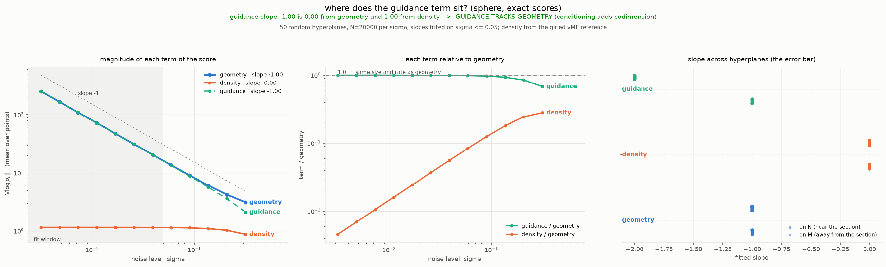

# Where the guidance term sits: score rates on conditional submanifolds

**Summary.** *When Scores Learn Geometry* separates the score of a smoothed
distribution into a geometric part and a density part that live at different
rates in the noise level, and shows that tempering the score therefore samples
the uniform measure on the data manifold. We ask where a **conditioning** term
falls in that hierarchy. For a linear constraint $\langle w, x\rangle = 0$, which
cuts the manifold $M$ down to a submanifold $N = M \cap H$ of one lower
dimension, we measure the guidance term exactly — no network, no learned
classifier, no Gaussian-posterior approximation — and find that it sits at the
**geometric** rate, not the density rate. Conditioning of this kind adds
codimension and is carried by the same mechanism that carries the manifold's own
shape, so a single tempering exponent suppresses the data density while
preserving both the manifold and the constraint. We also find that the exponent
depends on where it is measured, and that a disconnected $N$ obstructs the
sampler in a way the rate analysis does not see.

---

## 1. Setup and notation

Let $M \subset \mathbb{R}^d$ be a compact embedded submanifold of dimension $n$
and codimension $c = d - n$, and let $p_{\mathrm{data}}$ be a density on $M$ with
respect to its Riemannian volume measure. The variance-exploding forward process
is

$$
X_\sigma \;=\; X_0 + \sigma Z,
\qquad X_0 \sim p_{\mathrm{data}},\quad Z \sim \mathcal{N}(0, I_d),
$$

so the smoothed density is
$p_\sigma = p_{\mathrm{data}} * \mathcal{N}(0, \sigma^2 I)$ and the score is
$s_\sigma(x) = \nabla \log p_\sigma(x)$. Throughout we also use the Tweedie
displacement

$$
\hat{s}(x, \sigma) \;=\; \sigma^2 s_\sigma(x)
\;=\; \mathbb{E}\!\left[X_0 \mid X_\sigma = x\right] - x ,
\tag{1}
$$

which is $O(1)$ near $M$ and is what the implementation returns. Note that
$\hat{s}$ is a rescaling for numerical convenience; **every rate statement below
concerns $\nabla \log p_\sigma$ itself.**

Write $\delta(x) = \operatorname{dist}(x, M)$ and let $P_M$ denote the
nearest-point projection onto $M$.

### 1.1 The unconditional separation, recalled

Near $M$ the score splits into a normal and a tangential part,

$$
s_\sigma(x) \;=\; s_\sigma^{\perp}(x) + s_\sigma^{\parallel}(x),
\qquad
s_\sigma^{\perp}(x) \approx -\frac{x - P_M x}{\sigma^2},
\qquad
s_\sigma^{\parallel}(x) \longrightarrow \nabla_M \log p_{\mathrm{data}}(P_M x).
\tag{2}
$$

The normal field has **stiffness** $\Theta(\sigma^{-2})$ — that is the content of
$\partial \hat{s} / \partial x \approx -P_\perp$ — while the tangential field is
$\Theta(1)$. Two quantities are easily confused here, and the distinction matters
for reading any measurement:

| quantity | normal part | tangential part |
| --- | --- | --- |
| stiffness (coefficient) | $\Theta(\sigma^{-2})$ | $\Theta(1)$ |
| **magnitude at a typical noised point**, $\delta = \Theta(\sigma)$ | $\Theta(\sigma^{-1})$ | $\Theta(1)$ |

Because $\|s^{\perp}\| \sim \delta / \sigma^2$ with $\delta \sim \sigma$, the
normal magnitude is $\Theta(\sigma^{-1})$, not $\Theta(\sigma^{-2})$. Everything
measured in this report is a magnitude, so the geometric reference slope is
$-1$.

The separation is the **ratio**,

$$
\frac{\|s_\sigma^{\parallel}\|}{\|s_\sigma^{\perp}\|} \;=\; \Theta(\sigma)
\;\xrightarrow[\sigma \to 0]{}\; 0 ,
\tag{3}
$$

which is exactly what tempering exploits.

---

## 2. Conditioning on a hyperplane

Fix a unit vector $w \in \mathbb{R}^d$ and set

$$
H \;=\; \{\, x \in \mathbb{R}^d \;:\; \langle w, x\rangle = 0 \,\},
\qquad
N \;=\; M \cap H ,
$$

with $\dim N = n - 1$ for generic $w$. Conditioning on the event
$c := \{\langle X_0, w\rangle = 0\}$ is conditioning on a set of measure zero in
$M$; it is made precise as the disintegration of $p_{\mathrm{data}}$ along the
level sets of $x \mapsto \langle w, x\rangle$. The guided score decomposes as

$$
\underbrace{\nabla \log p_\sigma(x \mid c)}_{\text{guided}}
\;=\;
\underbrace{\nabla \log p_\sigma(x)}_{\text{geometry} \,+\, \text{density}}
\;+\;
\underbrace{\nabla \log p_\sigma(c \mid x)}_{\text{guidance}} ,
\tag{4}
$$

and the question of this report is the rate of the last term.

### 2.1 The guidance term is available in closed form

Because the constraint is **linear**, its posterior mean commutes with the
expectation, and Tweedie (1) supplies that expectation directly:

$$
m(x) \;:=\; \mathbb{E}\!\left[\langle w, X_0\rangle \,\middle|\, X_\sigma = x\right]
\;=\; \bigl\langle w,\; \mathbb{E}[X_0 \mid X_\sigma = x] \bigr\rangle
\;=\; \bigl\langle w,\; x + \hat{s}(x, \sigma) \bigr\rangle .
\tag{5}
$$

No classifier is trained, and none is needed for the mean. Writing
$v(x) := \operatorname{Var}\!\left[\langle w, X_0\rangle \mid X_\sigma = x\right]$
and using the Gaussian-posterior approximation
$p_\sigma(c \mid x) \approx \mathcal{N}(0; m, v)$,

$$
\nabla \log p_\sigma(c \mid x)
\;\approx\; -\frac{m(x)}{v(x)} \, \nabla m(x),
\qquad
\nabla m \;=\; \Bigl(I + \tfrac{\partial \hat{s}}{\partial x}\Bigr)^{\!\top} w .
\tag{6}
$$

This is the practitioner's form. For the *measurements* in Section 4 we avoid (6)
entirely and compute the guidance as the exact difference in (4), so that a wrong
answer would indict the theory rather than an approximation.

### 2.2 Predicted rates, and why they depend on the ensemble

Near $M$ the posterior on $X_0$ concentrates in a ball of radius $\sim \sigma$,
so $v = \Theta(\sigma^2)$. What changes between regions is the behaviour of $m$:

$$
\begin{aligned}
\text{near } N:\quad
  & m = \Theta(\sigma)
  &&\Longrightarrow&
  \|\nabla \log p_\sigma(c \mid x)\| &= \Theta\!\left(\sigma / \sigma^2\right) = \Theta(\sigma^{-1}), \\[4pt]
\text{away from } N:\quad
  & m = \Theta(1)
  &&\Longrightarrow&
  \|\nabla \log p_\sigma(c \mid x)\| &= \Theta\!\left(1 / \sigma^2\right) = \Theta(\sigma^{-2}).
\end{aligned}
\tag{7}
$$

Both are correct statements about different regions, and both matter: the second
is what *transports* mass onto $N$, the first is what *holds* it there and
therefore governs the stationary distribution. Reporting a single exponent for
"the guidance term" without naming the ensemble is meaningless.

---

## 3. What is measured, and how it is validated

We take $M = S^3 \subset \mathbb{R}^4$. Both laws are then uniform-on-a-sphere
after smoothing, and both scores are closed form. For the uniform measure on the
unit sphere $S^{k-1}$ convolved with $\mathcal{N}(0, \sigma^2 I_k)$,

$$
p_\sigma(x) \;\propto\; r^{-\nu} \, I_\nu\!\left(\frac{r}{\sigma^2}\right)
\exp\!\left(-\frac{r^2}{2\sigma^2}\right),
\qquad \nu = \frac{k}{2} - 1, \quad r = \|x\| ,
\tag{8}
$$

whose radial derivative collapses to a single Bessel ratio, the $-\nu/r$ terms
cancelling exactly:

$$
\frac{\partial}{\partial r} \log p_\sigma
\;=\; \frac{1}{\sigma^2}
\left[ \frac{I_{\nu+1}(z)}{I_{\nu}(z)} - r \right],
\qquad z = \frac{r}{\sigma^2} .
\tag{9}
$$

The section $S^3 \cap H$ is a great $S^2$ inside $w^{\perp}$, so
$p_\sigma(\,\cdot \mid c)$ factorises as $\mathcal{N}(0, \sigma^2)$ along $w$
times the $k = 3$ form of (8) inside $w^{\perp}$:

$$
\nabla \log p_\sigma(x \mid c)
\;=\;
\underbrace{\nabla_{w^{\perp}} \log p_\sigma^{(k=3)}\!\left(x - \langle w,x\rangle w\right)}_{\text{within the hyperplane}}
\;-\;
\underbrace{\frac{\langle w, x\rangle}{\sigma^2}\, w}_{\text{along } w} .
\tag{10}
$$

The guidance is then the exact difference of two exact scores.

**Reference gate.** Both closed forms are checked against self-normalised
importance sampling. A fixed relative tolerance is inappropriate: the effective
sample size of that estimator falls like $\sigma^{\dim}$, so the *reference* is
the noisy quantity. We therefore use a $z$-test against the estimator's own
standard error over $B = 16$ batches,

$$
z \;=\; \frac{\bigl| \, s^{\mathrm{closed}} - \bar{s}^{\mathrm{MC}} \, \bigr|}
              {\hat{\mathrm{se}}\bigl(\bar{s}^{\mathrm{MC}}\bigr)},
\qquad
z_{\max} \;=\; t_{B-1}\!\left(1 - \frac{\alpha}{2 n_{\mathrm{cmp}}}\right),
\tag{11}
$$

with the threshold set to the Bonferroni-corrected quantile of the resulting $t$
statistic rather than chosen by hand ($n_{\mathrm{cmp}} = 128$, $\alpha = 0.01$,
giving $z_{\max} = 5.37$). Where $\mathrm{ESS} > 200$ the worst observed $|z|$ is
$2.5$–$3.3$. Below that the estimator's $O(1/\mathrm{ESS})$ bias dominates and no
assertion is made.

**Density term.** A uniform law has no density term at all, so the $\Theta(1)$
reference is taken from the von Mises–Fisher mixture used elsewhere in this
project, whose smoothed score is closed form and separately gated. Estimating it
by Monte Carlo instead produces a spurious slope of $-1.87$, because the
estimator error enters divided by $\sigma^2$.

---

## 4. Results

Fifty random hyperplanes; $N = 20000$ points per noise level; slopes fitted by
least squares on $\log \|\cdot\|$ against $\log \sigma$ over the asymptotic
window $\sigma \le 0.05$.



### Ensemble I — points near the section, $X_0 \sim \mathrm{Unif}(N)$

| term | slope | sd | $R^2$ |
| --- | --- | --- | --- |
| geometry | $-0.999$ | $0.002$ | $1.0000$ |
| density | $-0.001$ | $0.001$ | flat |
| **guidance** | $\mathbf{-1.000}$ | $0.003$ | $1.0000$ |

Guidance lies $0.003 \pm 0.002$ from geometry and $0.999 \pm 0.003$ from density.
It is not merely parallel to the geometric term but numerically equal to it:
$253.1$ versus $250.5$ at $\sigma = 3 \times 10^{-3}$.

### Ensemble II — points on the manifold, $X_0 \sim \mathrm{Unif}(M)$

| term | slope | sd | $R^2$ |
| --- | --- | --- | --- |
| geometry | $-0.999$ | $0.002$ | $1.0000$ |
| density | $-0.001$ | $0.001$ | flat |
| **guidance** | $\mathbf{-2.001}$ | $0.003$ | $1.0000$ |

Here guidance is a full power of $\sigma$ **steeper** than geometry, matching the
prediction (7). It matches neither reference and should not be described as
tracking either. Both ensembles agree with the predicted exponents to within
$0.003$.

### 4.1 Consequence for tempered sampling

The tempered corrector integrates

$$
dX_t \;=\; \sigma^{\alpha}\, \hat{s}_c(X_t, \sigma)\, dt \;+\; \sqrt{2}\, dW_t,
\qquad
\hat{s}_c \;=\; \sigma^2 \bigl( s_\sigma + \nabla \log p_\sigma(c \mid \cdot) \bigr),
\tag{12}
$$

with transverse equilibrium width $\sigma^{1 - \alpha/2}$. Since the guidance
term sits at or above the geometric rate while the density term is one power of
$\sigma$ below it,

$$
\frac{\|\text{density}\|}{\|\text{geometry}\|} = \Theta(\sigma),
\qquad
\frac{\|\text{guidance}\|}{\|\text{geometry}\|} = \Theta(1)
\quad \text{near } N ,
\tag{13}
$$

any tempering that suppresses the density while preserving the manifold **also
preserves the constraint**. A single exponent suffices; the three-level hierarchy
one might expect — geometry, then conditioning, then density — does not arise for
a linear constraint. Conditioning of this kind behaves as *additional geometry*,
and the natural conjecture is that the unconditional theorem carries over with
the codimension increased by one.

---

## 5. Four findings the rate analysis does not capture

**Sampling on the sphere.** Running the guided tempered corrector at
$\sigma = 0.01$, $\alpha = 0.5$ from $p_{\mathrm{data}}$ reduces the constraint
residual from $0.42$ to $0.027$, with $\operatorname{dist}(x, M) = 0.028$ and
$|\langle w, x\rangle| = 0.027$ — nearly equal, and both at the predicted cloud
thickness $\sigma^{1-\alpha/2} = 0.032$. That equality is the dynamical
counterpart of the rate result: the constraint confines as tightly as the
manifold does. Departure from uniform on $N$ reaches $1.83\times$ the sampling
noise floor.

**The conditional sampler outperforms the unconditional one.** Under the same
$\sigma$ and $\alpha$, the unconditional corrector on $S^3$ plateaus at
$2.64\times$ the noise floor ($40000$ steps, confirmed converged), while the
guided corrector targeting $N$ reaches $1.83\times$. Adding a constraint does not
degrade the sampler, consistent with the constraint being carried by the same
mechanism as the manifold rather than fighting it.

**An unexplained failure at $\alpha = 1$.** The unconditional corrector on $S^3$
at $\alpha = 1$ plateaus at $10.33\times$ the noise floor — worse than at
$\alpha = 0.5$, and worse than doing nothing. It reproduces at $40000$ steps, so
it is not slow mixing, and the transverse thickness obeys $\sigma^{1-\alpha/2}$
to within $1.15\times$, so the integrator is behaving. On the Klein bottle the
same $\alpha = 1$ is the *best* setting ($1.91\times$). We have no explanation.

**Disconnection obstructs the sampler.** On a Klein bottle in $\mathbb{R}^4$, $N$
is a curve with two to four connected components depending on $w$. Local dynamics
cannot move mass between components: crossing requires an excursion off $N$,
which the guidance actively suppresses. After $20000$ steps the component masses
remain near their initial values — one component at $14.0\%$ against a target of
$33.8\%$, having started at $14.8\%$. This is an obstruction rather than slow
mixing, it is invisible to the rate analysis, and it would apply equally to a
class-conditional target whose class region is multimodal.

---

## 6. Limitations

1. **One manifold.** $S^3$ is maximally symmetric: $S^3 \cap H$ is a round $S^2$,
   it is always connected, and the co-area factor $\|P_{T_x M}\, w\|$ is exactly
   $1$. On the Klein bottle that factor varies by up to $7.4\times$. The rate
   result has not been reproduced where curvature varies.
2. **The density term comes from a different law** than the geometry and guidance
   terms. Each is measured where it is well defined, but the three do not form a
   single self-consistent setup.
3. **Magnitudes are means.** Medians and $90$th percentiles are recorded and
   track the means, but the theory is pointwise and no uniform-in-$x$ statement
   is made.
4. **Derivations are heuristic.** Equation (7) is a scaling argument, not a
   proof; its value is that it made a falsifiable prediction ($-1$ near $N$,
   $-2$ away) which the measurement then confirmed to three decimal places.
5. **No learned components.** Everything here is exact by construction. Whether a
   *learned* classifier can express a $\Theta(\sigma^{-2})$ guidance term is a
   separate question, and earlier work in this project found that a softmax head
   could not: it reached $81\%$ accuracy while producing a guidance term two
   orders of magnitude too small.

---

## 7. Reproduction

```bash
uv run python experiments/validate_intersection.py     # section geometry, 15/15
uv run python experiments/measure_rates.py             # the gate and the sweep
```

The first gates the conditional geometry: section samples lie on $M$ and on $H$
to $\sim 10^{-16}$, and their uniform samplers are verified against exact
analytic marginals — $\langle e, x\rangle \sim \mathrm{Unif}[-1, 1]$ on the
sphere by Archimedes' hat-box theorem, and arclength
$s \sim \mathrm{Unif}[0, L)$ on the Klein bottle. The second runs the Monte Carlo
gate of (11) and emits `rates.png` with its companion CSV.
